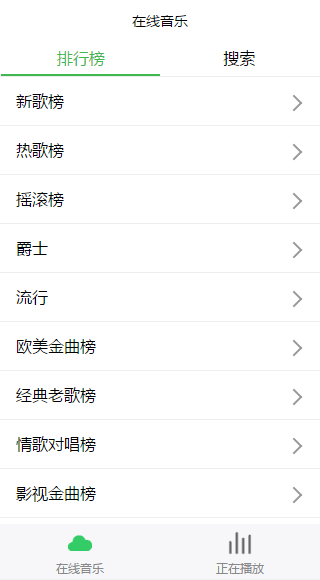
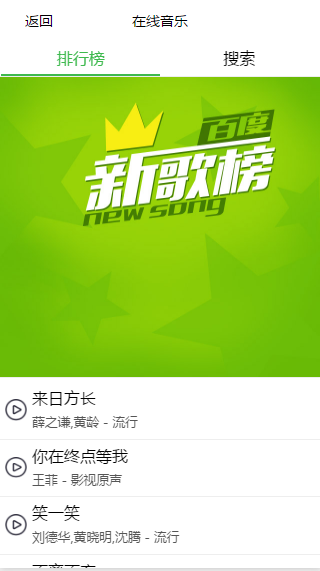
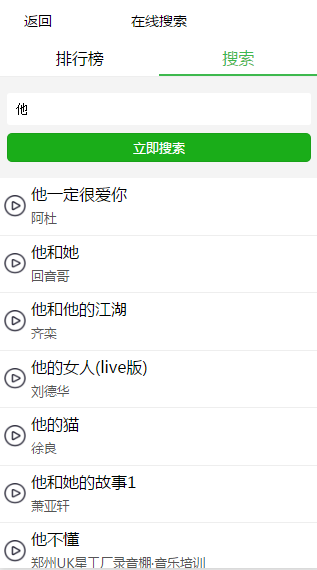

# 微信小程序： 音乐播放器

 - 歌曲资源来源于 [baidu音乐](http://music.baidu.com/)

# 说明

本项目使用 es2017 编码方式开发，感谢 [labrador](https://segmentfault.com/a/1190000007109050) 。

 - dist 项目编译后代码，在IDE新建项目时必须选择该文件夹预览
 - src 项目源代码目录，在里面可使用 es2017 语法

# 截图

榜单列表



歌曲列表



搜索页



播放页


# 安装方法

 - 克隆本项目
 - 进入目录安装依赖包
 - 启动服务

```shell
git clone https://github.com/eyasliu/wechat-app-music.git
cd wechat-app-music
npm install
npm start
```

### 命令说明

```shell
// 开发阶段，监听src目录下文件变动情况，即使编译并复制到dist文件夹
npm start 
```

```shell
// 打包编译项目
npm run build
```


# 贡献代码

如果您想继续为本项目贡献代码，请按以下指示

 1. 请先阅读文章 [使用Labrador 0.3构建ES6/ES7标准模块化微信小程序](https://segmentfault.com/a/1190000007109050?_ea=1242495)
 2. 克隆本项目并安装依赖
 3. `npm start` 启动开发监听服务
 4. 在小程序IDE新建项目，**此时目录必须选择 dist 文件夹**
 4. 修改 src 文件夹下代码，无论何时都不要直接编辑dist目录文件

## TODO

 - 集成redux管理数据状态
 - 集成 [野狗实时后端云](https://www.wilddog.com/)
 - 收藏列表，移出收藏
 - 切换上一曲/下一曲

